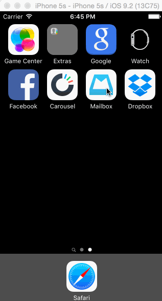

# Week 3 - week3-Mailbox

week3-Mailbox is a prototype of the Mailbox application to learn about gesture recognizers.

Submitted by: Vishay Nihalani

Time spent: 12 hours. My biggest challenge was figuring out how to synchronize the movement of UI elements with the swipes, so that they would push and pull correctly with the swipe.

## User Stories

The following **required** functionality is complete:
* [x] All of the required features are implemented

None of the **optional** functionality is complete.

The following **additional** features are implemented:
- [ ] List anything else that you can get done to improve the app functionality!

## Video Walkthrough

Here's a walkthrough of implemented user stories:

GIF created with [LiceCap](http://www.cockos.com/licecap/).

## Notes

Spent some time organizing my views correctly so that I could manipulate them the way I wanted.

## License

Copyright 2016 Vishay Nihalani

Licensed under the Apache License, Version 2.0 (the "License");
you may not use this file except in compliance with the License.
You may obtain a copy of the License at

http://www.apache.org/licenses/LICENSE-2.0

Unless required by applicable law or agreed to in writing, software
distributed under the License is distributed on an "AS IS" BASIS,
WITHOUT WARRANTIES OR CONDITIONS OF ANY KIND, either express or implied.
See the License for the specific language governing permissions and
limitations under the License.
